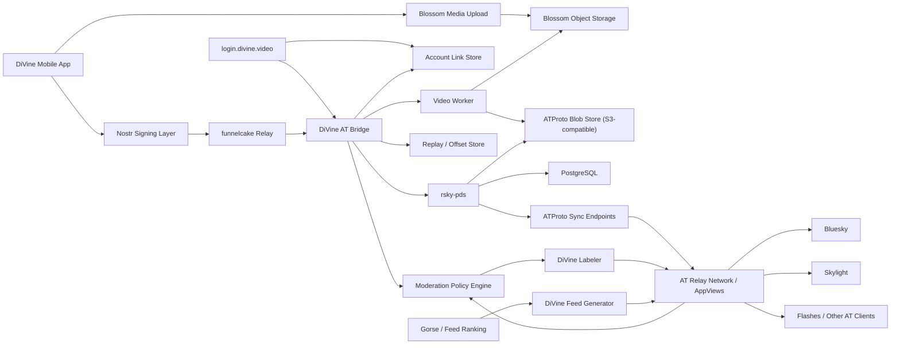
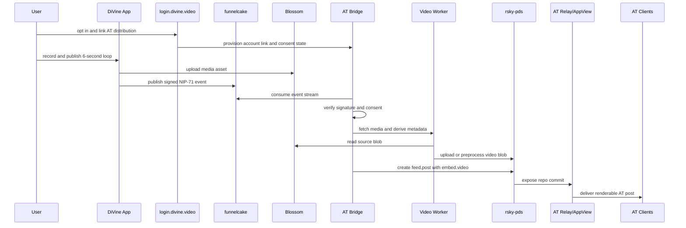

# DiVine ATProto Architecture Diagram Description

> Status: supporting diagram input. The canonical source of truth is `docs/plans/2026-03-20-divine-atproto-unified-plan.md`.

## Diagram Goal

Show DiVine's publish path from mobile creation through Nostr relay storage and into ATProto distribution, with all trust boundaries and storage layers labeled.

## Mermaid System Diagram

## Render Notes

Use these labels in the finished visual:

- "Source of truth" on `funnelcake Relay`
- "Derived distribution path" on `DiVine AT Bridge`
- "Consent and account linking" on `login.divine.video`
- "User-signed Nostr event" on the edge from `Nostr Signing Layer` to `funnelcake Relay`
- "Media bytes" on the path through Blossom
- "Repo writes and blob refs" on the edge from `DiVine AT Bridge` to `rsky-pds`
- "Federated sync" on the path from `rsky-pds` to `AT Relay Network / AppViews`

## Sequence Diagram

## Storage Layer Notes

- Blossom is the origin store for DiVine media on the Nostr side.
- The ATProto blob store is the authoritative blob host for mirrored AT records.
- PostgreSQL stores PDS state and bridge mapping state.
- Replay and offset storage must be durable enough to resume after outages without republishing duplicates.

## Trust Boundaries

- User trust boundary: DiVine app and the user's Nostr signature
- DiVine operational boundary: funnelcake, Blossom, bridge workers, PDS, moderation services
- Federated boundary: AT relays, AppViews, and downstream clients

## Diagram Caption

DiVine keeps Nostr as the authoring and storage source of truth, then republishes verified video posts into ATProto through a DiVine-operated PDS so standard AT clients can render the content without relying on third-party bridges.
