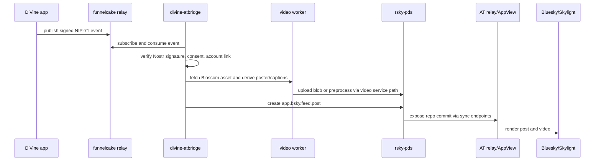

# DiVine ATProto Integration Technical Specification

> Status: supporting research document. The canonical source of truth is `docs/plans/2026-03-20-divine-atproto-unified-plan.md`.

## Goal

Make DiVine video posts available natively in the AT Protocol ecosystem without changing DiVine's authoring model: users sign once with Nostr, funnelcake remains the source of truth, and a DiVine-operated PDS republishes verified content into ATProto.

## Recommended Decisions

- Use a DiVine-operated multi-tenant PDS based on `rsky-pds` on a separate host such as `divine-pds.net`.
- Keep Nostr as the write path of record; ATProto is a derived distribution path.
- Use `did:plc` for user identities and `username.divine.video` handles.
- Do not reuse Nostr private keys for ATProto repos. Generate separate ATProto signing keys and protect them in KMS/HSM-backed custody.
- Publish standard `app.bsky.feed.post` records with `app.bsky.embed.video`. Avoid a public custom lexicon in MVP.
- Treat cross-network engagement as one-way at launch: publish out to ATProto, ingest analytics back, but do not mint synthetic Nostr likes/reposts/replies.

## Architecture

The publish path stays unchanged on DiVine:

1. DiVine app creates and signs a NIP-71 video event.
2. The event lands on funnelcake and associated media lands on Blossom.
3. A bridge worker tails funnelcake, verifies the Nostr signature and local consent state, resolves the user's ATProto repo, fetches the media, uploads or preprocesses it for the PDS, and writes an ATProto post.
4. Standard ATProto sync endpoints distribute the repo commit to relays, AppViews, and clients such as Bluesky, Skylight, and Flashes.

This keeps PDS outages out of DiVine's posting critical path. Recovery is replay-based: restart the bridge worker, replay from the last funnelcake cursor, and reconcile by `nostr_event_id`.

## Identity Architecture

### DID strategy

Use `did:plc`.

Reasoning:

- `did:plc` is the mainstream account identifier for hosted ATProto accounts and is designed for PDS migration.
- Bluesky's February 18, 2026 PLC replica release reinforces that PLC is still the durable migration layer, not a short-lived bootstrap mechanism.
- `did:web` would reduce one dependency but would make host migration and hostile-host exit materially worse, which conflicts with the portability goal.

Recommendation:

- DiVine controls the operational PLC rotation key in KMS.
- DiVine also provisions a separate disaster-recovery rotation key stored offline under organizational controls.
- Long term, export a user recovery package so users can leave DiVine without pleading with support.

### Handle resolution

Use subdomain handles: `username.divine.video`.

DNS and HTTP layout:

```text
_atproto.username.divine.video TXT "did=did:plc:abcd..."
https://username.divine.video/.well-known/atproto-did -> did:plc:abcd...
```

Operationally:

- Use wildcard DNS for `*.divine.video`.
- Serve `.well-known/atproto-did` dynamically from a handle service.
- Keep NIP-05 (`user@divine.video`) separate; it resolves Nostr identity, not ATProto identity.

### `login.divine.video` integration

Use `login.divine.video` as the human-facing control plane for ATProto onboarding and account management.

Recommended responsibilities:

- authenticate the existing DiVine user
- collect and store cross-posting consent
- trigger AT account provisioning on the PDS
- manage handle claim, recovery, export, and disable flows
- expose support and status UI for mirrored accounts

Recommended non-responsibilities:

- serving AT blobs
- acting as the repo host
- sharing browser auth state directly with the PDS origin

### Key management

Do not derive ATProto repo keys from Nostr keys, even though both ecosystems can use secp256k1.

Model:

- On opt-in, create an ATProto account and generate a dedicated repo signing keypair.
- Store private material in KMS/HSM-backed custody.
- Expose only public DID material in the DID document.
- Gate every republish action on a verified Nostr event signature plus an app-level consent grant.

This preserves the user experience the prompt wants: users never manually sign ATProto writes, but DiVine still has a defensible authorization chain.

### Identity linking

Do not add custom Nostr fields to the DID document unless the wider ATProto ecosystem standardizes them.

Use three layers instead:

- Internal source-of-truth table: `nostr_pubkey <-> did`.
- Public Nostr discoverability: include `atproto_did` in DiVine-controlled kind `0` profile metadata.
- Public AT provenance: keep an internal audit log in MVP; consider a later `video.divine.identity.link` record only if external verifiability becomes important.

### Consent flow

Recommended policy:

- Existing users: explicit one-time opt-in.
- New users: default-on during onboarding with clear language and a visible account-level toggle.
- Per-post override: `crosspost=false` tag or client flag for private or experimental clips.

Required controls:

- disable ATProto publishing
- remove handle from profile surfaces
- request AT-side replay or backfill
- delete mirrored AT records without deleting the original Nostr post

## PDS and Bridge Design

### Services

- `rsky-pds`: account, repo, blob, and sync host
- `divine-atbridge`: relay consumer, translator, and job orchestrator
- `divine-video-worker`: media fetch, thumbnail extraction, VTT generation, and upload
- `divine-moderation-adapter`: label translation and takedown queueing
- `rsky-feedgen` or a DiVine feed generator in phase 2

### Storage

- PostgreSQL for PDS and bridge metadata
- S3-compatible blob storage for ATProto media
- Redis only if horizontally scaling stateful rate limiting or job coordination
- Existing ClickHouse and NATS stay on the Nostr side

### Deployment model and starting capacity

Blacksky's public `rsky` materials describe the component split, but they do not publish a detailed public capacity plan. The sizing below is therefore an implementation estimate, not a quoted production benchmark.

Recommended launch footprint for an initial mirrored cohort:

- `rsky-pds`: 2 replicas, each 4 vCPU / 8 GB RAM
- `divine-atbridge`: 2 replicas, each 2 to 4 vCPU / 4 to 8 GB RAM
- `divine-video-worker`: autoscaled workers, 4 to 8 vCPU / 8 to 16 GB RAM depending on transcode load
- PostgreSQL: managed primary starting around 8 vCPU / 32 GB RAM with regular backups
- Object storage: S3-compatible bucket with lifecycle rules and CDN in front of hot media

This is appropriate for a controlled launch where DiVine is mirroring a subset of creators first. Video egress and moderation operations will dominate cost long before repo writes do.

### Recommended domains

ATProto's production guidance warns against co-hosting the PDS under the same domain family as the end-user app because blobs, auth pages, and OAuth/session surfaces should not share trust boundaries. Use a distinct host such as `divine-pds.net` or `divine-at.net` instead of `pds.divine.video` if DiVine expects more web properties later. If simplicity wins for MVP, document the risk and keep the PDS isolated behind strict cookie and origin boundaries.

Suggested split:

- `divine.video`: consumer-facing app surfaces
- `login.divine.video`: account linking and consent UI
- `divine-pds.net` or similar: ATProto PDS and blob host

## Data Model

Suggested bridge tables:

| Table | Purpose | Key fields |
| --- | --- | --- |
| `account_links` | Nostr-to-AT identity map | `nostr_pubkey`, `did`, `handle`, `crosspost_enabled`, `created_at` |
| `ingest_offsets` | Replay cursor per source | `source_name`, `last_event_id`, `last_created_at` |
| `asset_manifest` | Blob lineage and dedupe | `source_sha256`, `blossom_url`, `at_blob_cid`, `mime`, `bytes` |
| `record_mappings` | Nostr event to AT record | `nostr_event_id`, `did`, `collection`, `rkey`, `at_uri`, `cid`, `status` |
| `moderation_actions` | Cross-network policy actions | `subject_type`, `subject_id`, `action`, `origin`, `reason`, `state` |
| `publish_jobs` | Async orchestration | `nostr_event_id`, `attempt`, `state`, `error`, `updated_at` |

## Event Intake

Subscribe to funnelcake as a consumer, not as an inline publisher.

MVP filters:

- NIP-71 video events from linked users
- NIP-92 image/file metadata events referenced by those posts
- NIP-09 delete events for linked users
- kind `0` profile metadata events for linked users

Implementation notes:

- Prefer consuming the internal relay bus or NATS stream if available; use public Nostr websocket semantics only as the fallback.
- Check idempotency on `nostr_event_id`.
- Reject replayed, malformed, or unauthorized events before media work begins.
- Persist offsets after AT write confirmation, not before.

## Publish Sequence



## Nostr to ATProto Mapping

### Primary rule

Each DiVine video becomes a standard `app.bsky.feed.post` with an `app.bsky.embed.video` embed. Do not invent a custom top-level video collection for MVP.

### Field mapping

| DiVine / Nostr source | ATProto target | Notes |
| --- | --- | --- |
| NIP-71 event `id` | internal provenance only | store in `record_mappings`; optionally expose later |
| NIP-71 author pubkey | repo DID from `account_links` | never derive dynamically from content |
| title + description | `app.bsky.feed.post.text` | normalize into <=300 graphemes; if too long, keep title plus shortened description |
| hashtags | `facets` and `tags` | use richtext facets when text includes the tag; preserve up to 8 tags |
| mentions / URLs | `facets` | translate only canonical mentions/links that can survive client rendering |
| created timestamp | `createdAt` | use original Nostr creation time |
| language | `langs` | infer from Nostr metadata or classifier |
| content warning / labels | `labels.selfLabels` | map conservatively and let DiVine labeler add richer labels later |
| video blob | `embed.video.video` | upload as MP4 blob; current schema allows up to 100 MB |
| poster frame dimensions | `embed.video.aspectRatio` | width and height only |
| alt text | `embed.video.alt` | from creator alt text or generated accessibility text |
| caption track | `embed.video.captions[]` | convert to `text/vtt`, 20 tracks max, 20 KB each |
| loop hint | `embed.video.presentation` | default to `default`; test `gif` only for silent loop UX experiments |

Poster handling note:

- `app.bsky.embed.video` does not include a first-class poster image field.
- For standard ATProto clients, poster generation is effectively delegated to the video processing and rendering stack.
- DiVine should still derive and store a canonical poster frame for its own surfaces and for fallback previews outside AT clients.

### DiVine-specific metadata with no AT equivalent

Examples: canonical Blossom hash, original relay URL, clip remix lineage, loop-count hints, and moderation provenance.

MVP handling:

- Keep them in DiVine's bridge database.
- Link back to the original Nostr event from internal admin tools.
- Do not ship a public custom lexicon until DiVine proves a concrete product need.

## Blob Strategy

| Option | Feasibility | Pros | Cons | Recommendation |
| --- | --- | --- | --- | --- |
| A. Fetch from Blossom, then upload into PDS storage | Fully compatible | simple, spec-aligned, PDS controls lifecycle | duplicates storage and egress | MVP choice |
| B. Register Blossom URL directly as AT blob | Not a real fit | lowest duplication | breaks blob ownership assumptions; becomes an external embed, not native video | reject |
| C. Shared S3 backend behind Blossom and PDS | Viable with care | reduces duplicate raw-object storage | harder lifecycle and namespace control; AT derivatives may still differ from original | phase 2 optimization |

Additional note:

Bluesky's documented "recommended method" uploads video through the video service, which preprocesses the MP4 and writes the optimized blob back to the PDS. If DiVine wants maximum client compatibility, mimic that flow inside the PDS or via a DiVine-operated equivalent rather than treating the original Blossom asset as the final AT delivery object.

Hash lineage note:

- Blossom content is generally addressed by SHA-256 of the source bytes.
- ATProto blob references use CIDs for the uploaded blob object.
- If DiVine uploads a byte-identical file, it can record a deterministic lineage from `source_sha256` to `at_blob_cid`.
- If DiVine transcodes or preprocesses the asset, the AT blob is a derivative and should be tracked as a new object with explicit parentage.

## Repo Management

- Create the AT account when the user opts in, not on first publish.
- Use deterministic write policy: one Nostr video event maps to one AT post.
- Store returned `collection`, `rkey`, `at_uri`, and commit CID.
- Let the PDS own MST maintenance and `com.atproto.sync.*` serving.
- Keep bridge jobs idempotent so replaying the same event either no-ops or repairs a missing mapping.

The ATProto repository spec still uses Merkle Search Trees for repo storage, and official docs describe repositories as practical up to single-digit millions of records per account. That is comfortably above DiVine's expected per-user short-video volume.

## Deletion, Moderation, and Trust

### Deletion

When a NIP-09 delete event references a mirrored clip:

1. Look up the mapped AT URI.
2. Call `com.atproto.repo.deleteRecord`.
3. Mark the mapping as deleted but keep the provenance row.
4. Trigger downstream cache purge where DiVine controls it.

This removes DiVine-hosted AT content, but it does not erase already-fetched Nostr copies on third-party relays. The product language should be honest about that difference.

### Moderation

Recommended split:

- DiVine remains the source of moderation truth for DiVine-authored content.
- A DiVine labeler translates internal classifier output into AT labels.
- External AT labels and takedown notices feed back into a human review queue.

Do not automatically emit a Nostr deletion or moderation event because an AT labeler objected. Instead:

- hide or age-gate the clip on DiVine surfaces
- stop AT redistribution if policy requires it
- preserve an auditable moderation case file

## Profile Sync

Sync Nostr kind `0` to `app.bsky.actor.profile`.

| Nostr profile field | AT field |
| --- | --- |
| `name` / `display_name` | `displayName` |
| `about` | `description` |
| `website` | `website` |
| `picture` | `avatar` |
| `banner` | `banner` |

Directionality should stay one-way in MVP: DiVine profile edits overwrite AT profile state. Direct edits made elsewhere in the AT ecosystem are tolerated but not treated as authoritative.

## Feed and Discovery Integration

### Standard client compatibility

Publishing standard `app.bsky.feed.post` records with `app.bsky.embed.video` is the compatibility move. Skylight and other AT clients that already render Bluesky-native video should be able to display DiVine clips without a custom adapter.

Limits to accept:

- client loop behavior is not guaranteed
- some clients may ignore `presentation`
- custom DiVine metadata will not show up unless later standardized or surfaced through a feed/app-specific experience

### Feed generators

Phase 2 should add a DiVine feed generator that converts Gorse rankings into AT feed skeletons. That gives DiVine a way to expose "Trending Loops", topical feeds, and creator-curated streams while keeping the underlying posts standard.

### Custom lexicon position

MVP and phase 2 should stay on standard `app.bsky.*` types only.

Define `video.divine.*` later only if one of these becomes product-critical:

- public provenance of the Nostr source event
- loop-specific metadata that affects ranking or rendering
- creator rights or remix lineage that standard records cannot express

### RSS and Podcasting 2.0

Keep funnelcake and DiVine's existing RSS pipeline as the canonical feed source. The PDS should not become the primary RSS generator. At most, use AT mirrors as an additional discovery index or as a way to enrich public feed pages with AT URIs.

## Engagement Policy

Do not mirror AT likes, reposts, and replies back into Nostr as synthetic user actions in MVP.

Reasoning:

- DiVine would be speaking as the user on a second protocol without a Nostr signature.
- Cross-network reply threading becomes ambiguous quickly.
- Spam and moderation risk increases faster than product value.

Recommended compromise:

- ingest AT engagement as analytics and ranking signals
- optionally show "also liked/replied on ATProto" in DiVine admin or creator analytics
- revisit bidirectional reply sync only after identity, moderation, and abuse controls are mature

## Open Questions

- Whether DiVine should operate its own video preprocessing service or depend on the standard Bluesky video flow
- Whether to ship a public provenance lexicon for Nostr verification evidence
- Whether DiVine can commit to a separate long-lived PDS domain before launch so it does not carry hostname migration debt later
- How much of DiVine's moderation taxonomy should be collapsed into Bluesky-compatible self-labels versus emitted only from a DiVine labeler

## Sources

- NIP-71: https://github.com/nostr-protocol/nips/blob/master/71.md
- NIP-92: https://github.com/nostr-protocol/nips/blob/master/92.md
- NIP-09: https://github.com/nostr-protocol/nips/blob/master/09.md
- NIP-05: https://github.com/nostr-protocol/nips/blob/master/05.md
- ATProto repository spec: https://atproto.com/specs/repository
- ATProto production guidance: https://atproto.com/guides/going-to-production
- Bluesky video upload tutorial: https://docs.bsky.app/docs/tutorials/video
- Bluesky rate limits and PDS distribution v3: https://docs.bsky.app/blog/rate-limits-pds-v3
- PLC replicas announcement, February 18 2026: https://atproto.com/blog/plc-replicas
- Bluesky account count FAQ, February 2026: https://bsky.social/about/faq
- `rsky` repository README: https://github.com/blacksky-algorithms/rsky
