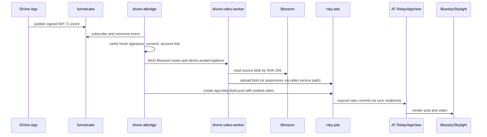

# DiVine ATProto Integration — Unified Technical Specification & Implementation Plan

> **For agentic workers:** REQUIRED: Use superpowers:subagent-driven-development (if subagents available) or superpowers:executing-plans to implement this plan. Steps use checkbox (`- [ ]`) syntax for tracking.

**Goal:** Make DiVine video posts available natively in the AT Protocol ecosystem — users sign once with Nostr, funnelcake remains the source of truth, and a DiVine-operated PDS republishes verified content into ATProto.

**Architecture:** A bridge worker tails the funnelcake Nostr relay, verifies Nostr signatures and consent state, resolves the user's ATProto repo, fetches media from Blossom, uploads/preprocesses it for the PDS, and writes standard `app.bsky.feed.post` records with `app.bsky.embed.video` embeds. Standard ATProto sync endpoints distribute repo commits to relays, AppViews, and clients (Bluesky, Skylight, Flashes).

**Tech Stack:** Rust (rsky-pds, Rocket, Diesel, Axum), PostgreSQL, S3-compatible blob storage (Cloudflare R2), Nostr WebSocket relay subscription, ATProto XRPC APIs, Gorse recommendation engine.

---

## Chunk 1: Core Decisions

These decisions are locked in. They synthesize the best of both research efforts and the original prompt spec.

### 1.1 Nostr Is the Source of Truth

ATProto is a **derived distribution path**, not a write path. The PDS is a consumer of the Nostr event stream. If it goes down, Nostr-side publishing is unaffected. Recovery is replay-based: restart the bridge worker, replay from the last funnelcake cursor, reconcile by `nostr_event_id`.

### 1.2 DID Strategy: `did:plc`

Use `did:plc` for all DiVine ATProto user identities.

**Why:**
- Account portability — users can migrate their ATProto identity away from DiVine's PDS
- Ecosystem compatibility — did:plc is dominant; all ATProto tooling is optimized for it
- PLC independence coming — ATProto is establishing the PLC directory as an independent Swiss association with WebSocket mirroring and transparency logs (February 2026 PLC replica release)
- `did:web` has no migration path and only supports hostname-level DIDs

**Key management:**
- DiVine controls the operational PLC rotation key in KMS/HSM
- DiVine provisions a separate disaster-recovery rotation key stored **offline under organizational controls** (hardware security module or paper key in a safe — never co-located with the operational key)
- Long term, export a user recovery package so users can leave DiVine without pleading with support

### 1.3 Handle Resolution: `username.divine.video`

DNS and HTTP layout:

```text
_atproto.username.divine.video TXT "did=did:plc:abcd..."
https://username.divine.video/.well-known/atproto-did -> did:plc:abcd...
```

- Use wildcard DNS for `*.divine.video`
- Serve `.well-known/atproto-did` dynamically from a handle service (recommended approach — DiVine controls the web server)
- Keep NIP-05 (`user@divine.video`) separate — it resolves Nostr identity, not ATProto identity

### 1.4 Custodial ATProto Signing Keys (Separate from Nostr)

Do **not** derive ATProto repo keys from Nostr keys, even though both use secp256k1.

- On opt-in, generate a dedicated ATProto repo signing keypair
- Store private material in KMS/HSM-backed custody
- Gate every republish action on a verified Nostr event signature plus an app-level consent grant
- did:plc supports key rotation via PLC directory — DiVine can rotate keys without user involvement

HKDF key derivation from Nostr keys is technically possible (same secp256k1 curve) but deferred to Phase 4 at earliest. For MVP, generate fresh independent keypairs.

### 1.5 Identity Linking: Conservative Approach

Do **not** add custom Nostr fields to the DID document unless the wider ATProto ecosystem standardizes them.

Three layers:
1. **Internal source-of-truth table:** `nostr_pubkey <-> did` (the `account_links` table)
2. **Public Nostr discoverability:** include `atproto_did` in DiVine-controlled kind `0` profile metadata + NIP-39 `i` tags
3. **Public AT provenance:** keep an internal audit log in MVP; consider a later `video.divine.identity.link` record only if external verifiability becomes product-critical

### 1.6 Consent Flow

- **Existing users:** explicit one-time opt-in
- **New users:** default-on during onboarding with clear language and visible account-level toggle
- **Per-post override:** `crosspost=false` tag or client flag for private/experimental clips

Required controls:
- Disable ATProto publishing
- Remove handle from profile surfaces
- Request AT-side replay or backfill
- Delete mirrored AT records without deleting the original Nostr post

### 1.7 Standard Lexicons Only for MVP

Use `app.bsky.feed.post` + `app.bsky.embed.video` exclusively. No custom `video.divine.*` lexicon until DiVine proves a concrete product need (public provenance, loop metadata, remix lineage).

### 1.8 One-Way Engagement

Do not mirror AT likes, reposts, or replies back into Nostr as synthetic user actions. DiVine would be speaking as the user on a second protocol without a Nostr signature.

Instead:
- Ingest AT engagement as analytics and ranking signals
- Optionally show "also liked/replied on ATProto" in creator analytics
- Revisit bidirectional sync only after identity, moderation, and abuse controls are mature

---

## Chunk 2: Service Architecture & Domain Model

### 2.1 PDS Domain: Separate Trust Boundary

ATProto production guidance warns against co-hosting the PDS under the same domain family as the end-user app because blobs, auth pages, and OAuth/session surfaces should not share trust boundaries.

**Decision required before launch:** If simplicity wins for MVP, `pds.divine.video` is acceptable — but document the risk and isolate the PDS behind strict cookie and origin boundaries. A separate domain like `divine-pds.net` avoids this class of issue entirely and is **strongly recommended** because PDS hostname is sticky (migration is painful).

**Domain split:**

| Domain | Purpose |
|--------|---------|
| `divine.video` | Consumer-facing app surfaces |
| `login.divine.video` | Account linking, consent UI, AT onboarding (see 2.1.1) |
| `divine-pds.net` (or similar) | ATProto PDS and blob host |
| `feed.divine.video` | Feed generator service DID (`did:web:feed.divine.video`) |
| `labeler.divine.video` | Public labeler service DID (`did:web:labeler.divine.video`) |

### 2.1.1 `login.divine.video` Responsibilities

**Does:**
- Authenticate the existing DiVine user
- Collect and store cross-posting consent
- Trigger AT account provisioning on the PDS
- Manage handle claim, recovery, export, and disable flows
- Expose support and status UI for mirrored accounts

**Does NOT:**
- Serve AT blobs
- Act as the repo host
- Share browser auth state directly with the PDS origin

### 2.2 Service Decomposition

Five services, each with a clear responsibility:

| Service | Responsibility | Tech |
|---------|---------------|------|
| `rsky-pds` | Account, repo, blob, and sync host | Rocket + Diesel + PostgreSQL + S3 |
| `divine-atbridge` | Relay consumer, translator, job orchestrator | Rust, Nostr WebSocket, NATS (optional) |
| `divine-video-worker` | Media fetch, thumbnail extraction, VTT generation, upload | Rust, Axum |
| `divine-moderation-adapter` | Label translation, takedown queueing | Rust |
| `divine-feedgen` | Feed skeleton API backed by Gorse | Rust or rsky-feedgen fork |

### 2.3 Storage

| System | Purpose | Notes |
|--------|---------|-------|
| PostgreSQL | PDS state + bridge metadata | Managed, e.g. Cloud SQL. ~8 vCPU / 32 GB RAM at launch |
| S3-compatible (Cloudflare R2) | ATProto video blobs | Zero egress costs. Key pattern: `{did}/{cid}` |
| Redis | Rate limiting, job coordination | Only if horizontally scaling bridge workers |
| ClickHouse + NATS | Existing Nostr-side infrastructure | Stays untouched |

**Durability requirement:** The `ingest_offsets` table (replay cursors) must be durable enough to resume after outages without republishing duplicates. Use PostgreSQL with `synchronous_commit = on` for this table.

### 2.4 Bridge Database Schema

Six tables for the bridge service:

| Table | Purpose | Key Fields |
|-------|---------|------------|
| `account_links` | Nostr-to-AT identity map | `nostr_pubkey`, `did`, `handle`, `crosspost_enabled`, `signing_key_id`, `created_at` |
| `ingest_offsets` | Replay cursor per source | `source_name`, `last_event_id`, `last_created_at` |
| `asset_manifest` | Blob lineage and dedupe | `source_sha256`, `blossom_url`, `at_blob_cid`, `mime`, `bytes`, `is_derivative` |
| `record_mappings` | Nostr event → AT record | `nostr_event_id`, `did`, `collection`, `rkey`, `at_uri`, `cid`, `status` |
| `moderation_actions` | Cross-network policy actions | `subject_type`, `subject_id`, `action`, `origin`, `reason`, `state` |
| `publish_jobs` | Async orchestration | `nostr_event_id`, `attempt`, `state`, `error`, `updated_at` |

### 2.5 Deployment Sizing (Launch Cohort)

| Component | Sizing | Notes |
|-----------|--------|-------|
| `rsky-pds` | 2 replicas, 4 vCPU / 8 GB each | |
| `divine-atbridge` | 2 replicas, 2-4 vCPU / 4-8 GB each | |
| `divine-video-worker` | Autoscaled, 4-8 vCPU / 8-16 GB | Depends on transcode load |
| PostgreSQL | Managed, ~8 vCPU / 32 GB | Regular backups |
| Object storage (R2) | Lifecycle rules + CDN | Zero egress |

**Monthly cost estimate (launch):** $1,000-3,000/month excluding heavy video egress spikes. Biggest drivers: object storage, bandwidth, moderation labor.

### 2.6 Event Intake

Subscribe to funnelcake as a consumer, not as an inline publisher.

**MVP filters:**
- NIP-71 video events (kinds 34235, 34236) from linked users
- NIP-92 image/file metadata events referenced by those posts
- NIP-09 delete events (kind 5) for linked users
- Kind `0` profile metadata events for linked users

**Implementation rules:**
- Prefer consuming the internal NATS stream if available; use public Nostr WebSocket as fallback
- Check idempotency on `nostr_event_id`
- Reject replayed, malformed, or unauthorized events before media work begins
- Persist offsets **after** AT write confirmation, not before
- Maintain a cursor/timestamp of last processed event for catch-up after downtime

### 2.7 Publish Sequence



---

## Chunk 3: Video Mapping & Blob Strategy

### 3.1 Field-by-Field Mapping: NIP-71 → ATProto

| DiVine / Nostr Source | ATProto Target | Notes |
|----|----|----|
| NIP-71 event `id` | Internal provenance only | Store in `record_mappings`; optionally expose later |
| NIP-71 author pubkey | Repo DID from `account_links` | Never derive dynamically from content |
| `title` + `content` (description) | `app.bsky.feed.post.text` | Normalize into ≤300 graphemes; if too long, keep title + shortened description |
| `t` tags (hashtags) | `facets[]` and `tags[]` | Use richtext facets when text includes the tag; preserve up to 8 tags |
| Mentions / URLs | `facets[]` | Translate only canonical mentions/links that survive client rendering |
| `created_at` timestamp | `createdAt` | Use original Nostr creation time (Unix → ISO 8601) |
| Language (from metadata or classifier) | `langs[]` | Infer from Nostr metadata or language classifier |
| Content warning / labels | `labels.selfLabels` | Map conservatively; let DiVine labeler add richer labels later |
| Video blob (`imeta.url`) | `embed.video.video` | Upload as MP4 blob; schema allows up to 100 MB |
| Poster frame dimensions (`imeta.dim`) | `embed.video.aspectRatio` | Parse "WxH" → `{width, height}` via GCD reduction |
| Alt text (`alt` tag) | `embed.video.alt` | From creator alt text or generated accessibility text |
| Caption tracks (`text-track` tags) | `embed.video.captions[]` | Convert to `text/vtt`, 20 tracks max, 20 KB each |
| Loop hint | `embed.video.presentation` | Default to `default`; test `gif` only for silent loop UX experiments |

**Poster handling:** `app.bsky.embed.video` has no first-class poster image field. Poster generation is delegated to the video processing and rendering stack. DiVine should still derive and store a canonical poster frame for its own surfaces and for fallback previews outside AT clients.

**DiVine-specific metadata with no AT equivalent** (Blossom hash, relay URL, remix lineage, loop-count hints, moderation provenance): keep in DiVine's bridge database. Link back to the original Nostr event from internal admin tools. Do not ship a public custom lexicon until DiVine proves a concrete product need.

### 3.2 Post Record Example

```json
{
  "$type": "app.bsky.feed.post",
  "text": "Sunset over the bay\n\n#sunset #nature #divine",
  "createdAt": "2026-03-20T12:00:00.000Z",
  "langs": ["en"],
  "facets": [
    {
      "index": {"byteStart": 21, "byteEnd": 28},
      "features": [{"$type": "app.bsky.richtext.facet#tag", "tag": "sunset"}]
    },
    {
      "index": {"byteStart": 29, "byteEnd": 36},
      "features": [{"$type": "app.bsky.richtext.facet#tag", "tag": "nature"}]
    },
    {
      "index": {"byteStart": 37, "byteEnd": 44},
      "features": [{"$type": "app.bsky.richtext.facet#tag", "tag": "divine"}]
    }
  ],
  "embed": {
    "$type": "app.bsky.embed.video",
    "video": {
      "$type": "blob",
      "ref": {"$link": "bafyreid..."},
      "mimeType": "video/mp4",
      "size": 3145728
    },
    "alt": "6-second loop: Sunset over the bay",
    "aspectRatio": {"width": 9, "height": 16}
  }
}
```

### 3.3 Post Text Construction

ATProto `feed.post.text` has a **300-grapheme limit**. Facet byte offsets must be computed on **UTF-8 byte positions** (not character offsets).

```rust
fn build_post_text(event: &NostrEvent) -> (String, Vec<Facet>) {
    let title = event.get_tag("title").unwrap_or_default();
    let summary = event.get_tag("summary")
        .or_else(|| if !event.content.is_empty() { Some(&event.content) } else { None })
        .unwrap_or_default();
    let hashtags: Vec<String> = event.get_tags("t")
        .iter().map(|t| format!("#{}", t)).collect();
    let hashtag_str = hashtags.join(" ");

    // Build candidate text: title, then summary, then hashtags
    let candidate = match (title.is_empty(), summary.is_empty()) {
        (false, false) => format!("{}\n\n{}", title, summary),
        (false, true) => title.to_string(),
        (true, false) => summary.to_string(),
        (true, true) => String::new(),
    };

    let full_text = if !hashtag_str.is_empty() {
        format!("{}\n\n{}", candidate, hashtag_str)
    } else {
        candidate
    };

    // Truncate to 300 graphemes if needed
    let text = truncate_graphemes(&full_text, 300);

    // Compute UTF-8 byte-offset facets for hashtags
    let facets = compute_hashtag_facets(&text);

    (text, facets)
}
```

### 3.4 Record Key Strategy

Use the NIP-71 `d` tag value as the ATProto record key (`rkey`). This enables:
- **Idempotent writes:** same Nostr event always maps to the same ATProto record
- **Cross-protocol addressing:** given a `d` tag, construct the AT-URI directly
- **Update support:** when a user publishes an updated NIP-71 event with the same `d` tag, the PDS uses `putRecord` (upsert) rather than `createRecord`

ATProto rkeys must match `[a-zA-Z0-9._~:@!$&'()*+,;=-]+` and be ≤512 chars. If the `d` tag contains invalid characters, use a base32-encoded hash of the `d` tag value.

### 3.5 Blob Strategy

**MVP: Option A — Fetch from Blossom, re-upload to PDS S3 storage.**

This is the only fully spec-compliant approach. ATProto requires the PDS to serve blobs via `com.atproto.sync.getBlob` — it must have the actual bytes.

```rust
async fn handle_video_blob(event: &NostrEvent) -> Result<BlobRef> {
    let (video_url, sha256_hash) = extract_video_info(event)?;

    // Dedupe: check if we already have this blob
    if let Some(existing) = blob_store.get_by_sha256(&sha256_hash).await? {
        return Ok(existing.cid_ref());
    }

    // Fetch from Blossom by SHA-256 hash
    let video_bytes = blossom_client.get(&sha256_hash).await?;

    // Verify integrity
    assert_eq!(sha256(&video_bytes), sha256_hash);

    // Upload to S3 as ATProto blob
    let cid = compute_cid(&video_bytes);
    blob_store.put(&cid, &video_bytes, "video/mp4").await?;

    // Record lineage in asset_manifest
    db.insert_asset_manifest(sha256_hash, video_url, cid, "video/mp4", video_bytes.len()).await?;

    Ok(BlobRef { cid, mime_type: "video/mp4", size: video_bytes.len() })
}
```

**Video preprocessing (OPEN QUESTION — see §5.4 #1):** Bluesky's documented "recommended method" uploads video through a video service that preprocesses the MP4 and writes the optimized blob back to the PDS. It is an open question whether DiVine should mimic this flow via `divine-video-worker` or upload raw Blossom MP4 directly. MVP should start with raw upload and test client compatibility; if clients struggle with unprocessed video, add preprocessing before launch.

**Phase 2 optimization (Option C):** Configure both Blossom and rsky-pds to use the same S3 bucket. Blossom stores by `<sha256hex>.mp4`; rsky-pds stores by CID. Actual bytes stored once, both systems maintain their own key/metadata. Eliminates storage duplication.

### 3.6 CID Construction from Blossom Hash

Blossom SHA-256 hex hashes and ATProto CID multihash components contain the same 32-byte digest. CID construction is deterministic:

```
Blossom SHA-256 hex: "a1b2c3d4e5..."  (64 hex chars = 32 bytes)

ATProto CID (CIDv1):
  bytes    = hex_decode(blossom_x_tag)           // 32 bytes
  multihash = [0x12, 0x20] ++ bytes              // sha2-256 code + length + digest
  cid      = CIDv1(codec=0x55, multihash)        // raw bytes codec
  encoded  = multibase_encode(base32lower, cid)  // "bafkrei..." prefix
```

If DiVine transcodes or preprocesses the asset, the AT blob is a derivative — track as a new object with explicit parentage in `asset_manifest.is_derivative`.

### 3.7 Storage Cost Estimates

Using Cloudflare R2 (zero egress):

| Scale | Corpus Size | R2 Storage/mo | Notes |
|-------|------------|---------------|-------|
| 10K videos | ~50 GB | ~$0.75 | Launch cohort |
| 100K videos | ~500 GB | ~$7.50 | Growth phase |
| 1M videos | ~5 TB | ~$75 | At scale |

**Recommendation:** Use Cloudflare R2 from day 1. Zero egress costs eliminate the main variable cost driver. CDN-front blob serving for additional performance.

---

## Chunk 4: Feed, Discovery, Moderation & Legal

### 4.1 Feed Generators

Phase 2. DiVine operates an ATProto feed generator that converts Gorse rankings into AT feed skeletons.

**Three feeds:**

| Feed | Algorithm | Data Source |
|------|-----------|-------------|
| `divine-latest` | Reverse chronological | DiVine PDS PostgreSQL |
| `divine-trending` | Engagement velocity | Nostr-side engagement initially; add ATProto signals after Phase 3 |
| `divine-for-you` | Personalized ML | Gorse HTTP API per user DID |

**Key simplification:** Most feed generators consume the full ATProto firehose. DiVine only needs its own posts — index from DiVine's PDS PostgreSQL directly.

**Feed generator DID:** `did:web:feed.divine.video` — no PLC dependency for service DIDs.

```rust
async fn get_feed_skeleton(params: GetFeedSkeletonParams) -> Result<FeedSkeleton> {
    match params.feed.as_str() {
        uri if uri.ends_with("/trending") => {
            let recs = gorse_client.get_popular_items("video", params.limit).await?;
            let posts: Vec<SkeletonItem> = recs.iter()
                .filter_map(|r| db.get_atproto_uri_for_item(&r.item_id))
                .map(|uri| SkeletonItem { post: uri })
                .collect();
            Ok(FeedSkeleton { feed: posts, cursor: None })
        },
        uri if uri.ends_with("/latest") => {
            let posts = db.get_recent_divine_posts(params.limit, params.cursor).await?;
            Ok(FeedSkeleton { feed: posts, cursor: posts.last().map(|p| p.cursor.clone()) })
        },
        _ => Err(Error::UnknownFeed),
    }
}
```

### 4.2 Client Compatibility

Publishing standard `app.bsky.feed.post` + `app.bsky.embed.video` is the compatibility move. Skylight, Flashes, Bluesky, and other AT clients render this without custom adapters.

**Limits to accept:**
- Client loop behavior is not guaranteed (but short videos loop by default in most clients)
- Some clients may ignore `presentation` hint
- Custom DiVine metadata will not show up unless later standardized

### 4.3 Custom Lexicon Position

MVP and Phase 2: standard `app.bsky.*` types only.

Define `video.divine.*` later only if one of these becomes product-critical:
- Public provenance of the Nostr source event
- Loop-specific metadata that affects ranking or rendering
- Creator rights or remix lineage

**Propose `loop: boolean` to [lexicon.community](https://lexicon.community)** — other short-form video apps would benefit, raising DiVine's profile.

### 4.4 Cold-Start Discovery Strategy

1. **Feed marketplace:** register all three DiVine feeds with clear descriptions on day one
2. **Starter pack:** "DiVine on Bluesky" bundling top 20 creators + all three feeds
3. **In-app CTA:** surface Bluesky follow prompts within DiVine for existing users
4. **Identity linking:** allow existing Bluesky users to connect their handle to DiVine
5. **Cross-protocol signals:** show ATProto engagement in DiVine to motivate creators

### 4.5 DiVine as ATProto Labeler

Phase 3. DiVine operates as an ATProto labeler, mapping AI classification to ATProto labels.

**Two labeler identities:**
1. **`did:web:labeler.divine.video`** — public labeler for AI-classified content. Bluesky users can subscribe.
2. **PDS admin account** — platform-level enforcement (takedowns, account bans) not for public distribution.

**Label mapping:**

| DiVine AI Classification | ATProto Label | Behavior |
|---|---|---|
| NSFW / Adult | `porn` | Hidden by default |
| Suggestive | `sexual` | Warning interstitial |
| Nudity (artistic) | `nudity` | Warning interstitial |
| Violence/Gore | `gore` | Hidden by default |
| Sensitive content | `graphic-media` | Warning interstitial |
| Safe | (no label) | Shown normally |

**Content warning mapping (Nostr → ATProto self-labels):**
- `"NSFW"` → `val: "porn"` or `"sexual"`
- `"spoiler"` → `val: "!warn"` (custom)
- `"violence"` → `val: "gore"`
- `(any text)` → `val: "!warn"` + custom label text

**Use Ozone** (Bluesky's open-source moderation tool, MIT-licensed) as the moderation backend. Extend with Nostr integration for bidirectional report handling.

### 4.6 Incoming ATProto Moderation

When external labelers flag DiVine content:
- **`!takedown`:** remove record from ATProto repo
- **`!suspend`:** disable user's ATProto account
- Feed back to DiVine moderation queue for Nostr-side review

Do **not** automatically emit a Nostr deletion event because an AT labeler objected. Instead:
- Hide or age-gate the clip on DiVine surfaces
- Stop AT redistribution if policy requires
- Preserve an auditable moderation case file

### 4.7 Deletion Propagation

When a NIP-09 delete event references a mirrored clip:
1. Look up the mapped AT URI in `record_mappings`
2. Call `com.atproto.repo.deleteRecord`
3. Mark the mapping as deleted but keep the provenance row
4. Trigger downstream cache purge where DiVine controls it

Product language should be honest: this removes DiVine-hosted AT content but does not erase already-fetched Nostr copies on third-party relays.

### 4.8 Legal Compliance

| Requirement | Nostr Side | ATProto Side |
|---|---|---|
| DMCA takedown | Advisory deletion (NIP-09) | PDS enforces deletion, removes from repo |
| Right to be forgotten | Cannot guarantee | PDS can delete all records and revoke DID |
| Geographic restrictions | Not enforceable at protocol level | PDS can geo-block at serving layer |
| CSAM | Immediate removal from relay, **do not bridge** | Immediate PDS deletion + NCMEC report |

**DMCA Safe Harbor (17 U.S.C. § 512(c)):** DiVine qualifies as service provider. Requirements: designated DMCA agent (US Copyright Office), expeditious response, repeat infringer policy. Maintain SHA-256 hash registry of taken-down material for repeat-upload detection across both protocols.

**Privacy policy must disclose:** content bridged to Nostr propagates to a decentralized network not under DiVine's control. Complete deletion from all third-party relays cannot be guaranteed.

### 4.9 Profile Sync (Phase 2, One-Way)

| Nostr Kind 0 Field | ATProto `app.bsky.actor.profile` | Notes |
|---|---|---|
| `name` / `display_name` | `displayName` | Direct mapping |
| `about` | `description` | Max 2560 graphemes |
| `picture` | `avatar` | Blob reference |
| `banner` | `banner` | Blob reference |

Directionality: one-way. DiVine profile edits overwrite AT profile state. Direct edits made elsewhere in AT are tolerated but not authoritative.

---

## Chunk 5: Roadmap, Competitive Analysis & Risks

### 5.1 Phased Roadmap

#### Phase 1: MVP Distribution (8-12 person-weeks)

| Task | Effort | Dependencies |
|---|---|---|
| Account linking + `did:plc` provisioning | 1-1.5 weeks | PLC directory API |
| Handle resolution (`.well-known` service) | 0.5 weeks | DNS setup |
| Custodial key management (KMS/HSM) | 1 week | Secrets infra |
| `rsky-pds` deployment + configuration | 2 weeks | PostgreSQL, R2 |
| Bridge database schema + migrations | 0.5 weeks | PostgreSQL |
| `divine-atbridge`: Nostr relay subscription | 1 week | funnelcake WebSocket / NATS |
| `divine-atbridge`: NIP-71 → ATProto translation | 1.5 weeks | Video mapping spec |
| `divine-video-worker`: blob fetch + upload | 1 week | Blossom API, R2 |
| Deletion propagation (NIP-09 → deleteRecord) | 0.5 weeks | — |
| `login.divine.video`: consent + account linking UI | 1 week | Mobile app update |

**Infrastructure:** $1,000-3,000/month

**Success metrics:**
- 95%+ mirrored-publish success within 2 minutes
- Under 0.5% replay or duplicate-write errors
- At least 25% of active DiVine creators opt in within first launch cohort
- PDS stays in sync with relay network

**Key risks:**
- `rsky` is pre-1.0 — maintain fallback plan for reference TypeScript PDS
- BGS crawl initiation is semi-manual for new PDSes
- Handle and PDS hostname choices are sticky; sloppy launch creates migration debt

#### Phase 2: Discovery & Ranking (4-6 person-weeks)

| Task | Effort |
|---|---|
| Feed generator service (`divine-latest`, `divine-trending`) | 2 weeks |
| Gorse → feed generator integration (`divine-for-you`) | 1 week |
| Profile sync (Nostr kind 0 → `app.bsky.actor.profile`) | 1 week |
| Richer caption and hashtag handling | 0.5 weeks |
| Analytics for AT reach and watch-through | 0.5 weeks |

**Additional infrastructure:** $500-1,500/month

**Success metrics:**
- At least 10,000 feed subscriptions across DiVine-owned AT feeds
- Measurable watch-through lift vs generic Bluesky distribution
- Profile data syncs within 5 minutes of Nostr update

#### Phase 3: Moderation & Engagement Intelligence (6-10 person-weeks)

| Task | Effort |
|---|---|
| DiVine labeler service (AI labels → ATProto) | 2-3 weeks |
| Moderation queue for inbound AT labels/reports | 1-2 weeks |
| Analytics-only ingest of AT engagement | 1-2 weeks |
| Creator dashboards showing AT reach | 1-2 weeks |
| Ozone integration | 1 week |

**Additional infrastructure:** $1,000-2,000/month

**Success metrics:**
- Human review SLA under 24 hours for cross-network cases
- Creator dashboard usage by 40%+ of mirrored accounts
- 100% compliance with ATProto takedown requests

#### Phase 4: Advanced Protocol Product (8-12 person-weeks per feature cluster)

- Optional `video.divine.*` lexicons for provenance / richer metadata
- Experimental loop-aware presentation features
- Selective bidirectional interaction (if user-signed delegation becomes viable)
- Reuse of bridge pattern for other Nostr kinds (text notes, long-form)
- Shared S3 backend optimization (Option C blob strategy)

### 5.2 Competitive Landscape

| Platform | Approach | Status |
|---|---|---|
| **DiVine** | Nostr-native + ATProto PDS | Adding ATProto (this project) |
| **Skylight** | ATProto-native, Mark Cuban backed | Launched Apr 2025, 380K+ users |
| **Flashes** | ATProto-native (photo + video) | Launched Feb 2025, 68K+ followers |
| **Reelo/Spark** | Custom ATProto lexicon | Pre-launch, sole developer |
| **Bridgy Fed** | Bridge service (ActivityPub ↔ ATProto) | Live; Nostr support planned |
| **Mostr** | Bridge (Nostr ↔ ActivityPub) | Live |

**DiVine's unique advantage:** dual-nativity. Content on both Nostr (censorship-resistant, user-sovereign keys) and ATProto (large user base, rich app ecosystem). If either network has issues, the other continues to work.

**Why native PDS beats bridges:**
- Full control over identity, handles, moderation, media lifecycle
- DiVine-optimized video translation
- No third-party dependency (Bridgy Fed doesn't even support Nostr yet)
- Native branding (`username.divine.video` handles)

**Network effects:** Bluesky ~42M registered users, Skylight ~380K users (these are account-level numbers, not guaranteed active audience — the realistic near-term target is incremental impressions via AT discovery, not "all of Bluesky"). Even capturing 0.1% through feed subscriptions would be significant compared to Nostr's ~500K-1M active users.

**Cost minimization strategy:**
- Keep ATProto mirroring opt-in at first (controls blob growth)
- Dedupe source blobs in shared storage where feasible
- Use standard `app.bsky.*` records before funding custom-protocol work
- Video egress and moderation labor will dominate costs before repo writes do

### 5.3 Top Risks

| Risk | Severity | Mitigation |
|------|----------|------------|
| `rsky` pre-1.0 instability | Medium-High | Apache 2.0 fork rights; fallback to reference TypeScript PDS; maintain Blacksky relationship |
| Video preprocessing / blob costs | Medium | R2 zero egress; opt-in-only launch; dedupe in `asset_manifest` |
| PDS hostname is sticky | High | Decide separate domain (`divine-pds.net`) before any public launch |
| Rate limits (1,500 events/hr, 10K/day per PDS) | Medium | Per-user rate limiting in bridge; request elevated limits; DiVine's low-volume format helps |
| Cross-network moderation failures | Medium-High | Build case-management path in Phase 3 before scaling; Ozone integration |
| BGS crawl initiation | Low | Semi-manual step; coordinate with ATProto team pre-launch |
| ATProto spec changes | Low | Lexicon versioning prevents breaking changes; `app.bsky.embed.video` is stable and widely used |
| Bidirectional engagement temptation | Medium | Explicitly deferred to Phase 4+; resist scope creep |

### 5.4 Open Questions (Requiring Team Decision)

1. **Video preprocessing:** Should DiVine operate its own video preprocessing service (mimicking Bluesky's video flow), or upload raw Blossom MP4 directly? Affects client compatibility.
2. **PDS domain:** Finalize `divine-pds.net` or alternative before any public launch. This is sticky — migration is painful.
3. **Provenance lexicon:** Ship a public `video.divine.identity.link` record for Nostr verification evidence? Only if external verifiability becomes product-critical.
4. **Label taxonomy:** How much of DiVine's moderation taxonomy should collapse into Bluesky-compatible self-labels vs. be emitted only from a DiVine labeler?
5. **Legal entity:** Verse Communications (day-to-day ops) vs. andOtherStuff (nonprofit, governance) vs. studio.coop (cooperative model). Recommendation: Verse for ops, governance under studio.coop/andOtherStuff.

### 5.5 Security Considerations

| Attack | Mitigation |
|--------|------------|
| Replay (rebroadcast old event) | Event ID dedup in `record_mappings`; reject `created_at` older than window |
| Key compromise | Emergency revocation: delist ATProto DID from bridge; rotate via PLC |
| Event type confusion | Strict kind validation — only accept 34235, 34236, 5 |
| DoS via flood of valid events | Per-key rate limiting at bridge layer |
| PLC document manipulation | Monitor for unexpected DID document changes; alert on rotation |

---

## Chunk 6: Implementation Tasks (Phase 1 MVP)

### File Structure

```
divine-sky/
├── Cargo.toml                          # Workspace root
├── crates/
│   ├── divine-atbridge/
│   │   ├── Cargo.toml
│   │   └── src/
│   │       ├── main.rs                 # Bridge service entry point
│   │       ├── config.rs               # Environment config
│   │       ├── nostr_consumer.rs       # Funnelcake WebSocket subscription
│   │       ├── signature.rs            # Nostr signature verification
│   │       ├── translator.rs           # NIP-71 → ATProto record translation
│   │       ├── text_builder.rs         # Post text + facets construction
│   │       ├── publisher.rs            # Write records to rsky-pds via XRPC
│   │       └── deletion.rs             # NIP-09 → deleteRecord
│   ├── divine-video-worker/
│   │   ├── Cargo.toml
│   │   └── src/
│   │       ├── main.rs                 # Video worker entry point
│   │       ├── blossom.rs              # Blossom fetch client
│   │       ├── cid.rs                  # SHA-256 → CID conversion
│   │       ├── blob_upload.rs          # Upload to PDS S3 storage
│   │       └── thumbnail.rs            # Poster frame extraction (Phase 2)
│   ├── divine-bridge-db/
│   │   ├── Cargo.toml
│   │   └── src/
│   │       ├── lib.rs                  # Database access layer
│   │       ├── models.rs               # Diesel models for 6 bridge tables
│   │       ├── schema.rs               # Diesel schema (auto-generated)
│   │       └── queries.rs              # Named queries (idempotency checks, lookups)
│   └── divine-bridge-types/
│       ├── Cargo.toml
│       └── src/
│           └── lib.rs                  # Shared types across bridge crates
├── migrations/
│   └── 001_bridge_tables/
│       ├── up.sql                      # Create 6 bridge tables
│       └── down.sql                    # Drop tables
├── config/
│   ├── bridge.toml.example             # Example config
│   └── docker-compose.yml              # Local dev: PostgreSQL + Redis + MinIO
├── tests/
│   ├── integration/
│   │   ├── translate_nip71_test.rs     # End-to-end NIP-71 → ATProto
│   │   ├── blob_pipeline_test.rs       # Blossom fetch → S3 upload
│   │   ├── deletion_test.rs            # NIP-09 → deleteRecord
│   │   └── idempotency_test.rs         # Duplicate event handling
│   └── unit/
│       ├── text_builder_test.rs        # Post text + facet construction
│       ├── cid_test.rs                 # SHA-256 → CID conversion
│       └── signature_test.rs           # Nostr signature verification
└── docs/
    ├── superpowers/plans/              # This plan
    └── research/                       # Prior research (Codex + Claude)
```

### Task 1: Workspace Setup & Database Schema

**Files:**
- Create: `Cargo.toml` (workspace root)
- Create: `crates/divine-bridge-db/Cargo.toml`
- Create: `crates/divine-bridge-db/src/lib.rs`
- Create: `crates/divine-bridge-db/src/models.rs`
- Create: `crates/divine-bridge-db/src/schema.rs`
- Create: `crates/divine-bridge-types/Cargo.toml`
- Create: `crates/divine-bridge-types/src/lib.rs`
- Create: `migrations/001_bridge_tables/up.sql`
- Create: `migrations/001_bridge_tables/down.sql`
- Create: `config/docker-compose.yml`

- [ ] **Step 1: Create workspace Cargo.toml**

```toml
[workspace]
members = [
    "crates/divine-atbridge",
    "crates/divine-video-worker",
    "crates/divine-bridge-db",
    "crates/divine-bridge-types",
]
resolver = "2"

[workspace.dependencies]
diesel = { version = "2.2", features = ["postgres", "chrono"] }
tokio = { version = "1", features = ["full"] }
serde = { version = "1", features = ["derive"] }
serde_json = "1"
anyhow = "1"
tracing = "0.1"
tracing-subscriber = "0.3"
chrono = { version = "0.4", features = ["serde"] }
```

- [ ] **Step 2: Create docker-compose.yml for local dev**

```yaml
services:
  postgres:
    image: postgres:16
    environment:
      POSTGRES_DB: divine_bridge
      POSTGRES_USER: divine
      POSTGRES_PASSWORD: divine_dev
    ports:
      - "5432:5432"
    volumes:
      - pgdata:/var/lib/postgresql/data
  minio:
    image: minio/minio
    command: server /data --console-address ":9001"
    environment:
      MINIO_ROOT_USER: divine
      MINIO_ROOT_PASSWORD: divine_dev
    ports:
      - "9000:9000"
      - "9001:9001"
volumes:
  pgdata:
```

- [ ] **Step 3: Write migration SQL**

```sql
-- migrations/001_bridge_tables/up.sql
CREATE TABLE account_links (
    nostr_pubkey    TEXT PRIMARY KEY,
    did             TEXT UNIQUE NOT NULL,
    handle          TEXT UNIQUE NOT NULL,
    crosspost_enabled BOOLEAN NOT NULL DEFAULT FALSE,
    signing_key_id  TEXT NOT NULL,
    created_at      TIMESTAMPTZ NOT NULL DEFAULT NOW()
);

CREATE TABLE ingest_offsets (
    source_name     TEXT PRIMARY KEY,
    last_event_id   TEXT NOT NULL,
    last_created_at TIMESTAMPTZ NOT NULL
);

CREATE TABLE asset_manifest (
    source_sha256   TEXT PRIMARY KEY,
    blossom_url     TEXT,
    at_blob_cid     TEXT NOT NULL,
    mime            TEXT NOT NULL,
    bytes           BIGINT NOT NULL,
    is_derivative   BOOLEAN NOT NULL DEFAULT FALSE,
    created_at      TIMESTAMPTZ NOT NULL DEFAULT NOW()
);

CREATE TABLE record_mappings (
    nostr_event_id  TEXT PRIMARY KEY,
    did             TEXT NOT NULL REFERENCES account_links(did),
    collection      TEXT NOT NULL,
    rkey            TEXT NOT NULL,
    at_uri          TEXT NOT NULL,
    cid             TEXT,
    status          TEXT NOT NULL DEFAULT 'published',
    created_at      TIMESTAMPTZ NOT NULL DEFAULT NOW()
);
CREATE UNIQUE INDEX idx_record_mappings_at_uri ON record_mappings(at_uri);

CREATE TABLE moderation_actions (
    id              BIGSERIAL PRIMARY KEY,
    subject_type    TEXT NOT NULL,
    subject_id      TEXT NOT NULL,
    action          TEXT NOT NULL,
    origin          TEXT NOT NULL,
    reason          TEXT,
    state           TEXT NOT NULL DEFAULT 'pending',
    created_at      TIMESTAMPTZ NOT NULL DEFAULT NOW()
);

CREATE TABLE publish_jobs (
    nostr_event_id  TEXT PRIMARY KEY,
    attempt         INT NOT NULL DEFAULT 0,
    state           TEXT NOT NULL DEFAULT 'pending',
    error           TEXT,
    created_at      TIMESTAMPTZ NOT NULL DEFAULT NOW(),
    updated_at      TIMESTAMPTZ NOT NULL DEFAULT NOW()
);
CREATE INDEX idx_publish_jobs_state ON publish_jobs(state);
```

- [ ] **Step 4: Create divine-bridge-types crate with shared types**

- [ ] **Step 5: Create divine-bridge-db crate with Diesel models and queries**

- [ ] **Step 6: Verify migration runs against docker-compose PostgreSQL**

Run: `docker compose -f config/docker-compose.yml up -d && diesel migration run`
Expected: Tables created successfully

- [ ] **Step 7: Commit**

```bash
git add -A
git commit -m "feat: workspace setup with bridge database schema and shared types"
```

### Task 2: CID Construction & Blob Utilities

**Files:**
- Create: `crates/divine-video-worker/Cargo.toml`
- Create: `crates/divine-video-worker/src/cid.rs`
- Create: `tests/unit/cid_test.rs`

- [ ] **Step 1: Write failing test for SHA-256 → CID conversion**

```rust
#[test]
fn test_sha256_hex_to_cid() {
    // Known SHA-256 hash
    let sha256_hex = "2cf24dba5fb0a30e26e83b2ac5b9e29e1b161e5c1fa7425e73043362938b9824";
    let cid = sha256_to_cid(sha256_hex).unwrap();

    // CID should start with "bafkrei" (base32lower CIDv1 raw)
    assert!(cid.starts_with("bafkrei"));

    // Round-trip: extract hash from CID, compare
    let extracted = cid_to_sha256(&cid).unwrap();
    assert_eq!(extracted, sha256_hex);
}
```

- [ ] **Step 2: Run test to verify it fails**

Run: `cargo test -p divine-video-worker test_sha256_hex_to_cid`
Expected: FAIL — function not defined

- [ ] **Step 3: Implement CID conversion**

```rust
use multihash::{Code, MultihashDigest};
use cid::Cid;

pub fn sha256_to_cid(sha256_hex: &str) -> anyhow::Result<String> {
    let digest_bytes = hex::decode(sha256_hex)?;
    anyhow::ensure!(digest_bytes.len() == 32, "SHA-256 must be 32 bytes");

    let mh = Code::Sha2_256.wrap(&digest_bytes)?;
    let cid = Cid::new_v1(0x55, mh); // 0x55 = raw codec
    Ok(cid.to_string()) // base32lower by default
}

pub fn cid_to_sha256(cid_str: &str) -> anyhow::Result<String> {
    let cid = Cid::try_from(cid_str)?;
    let mh = cid.hash();
    let digest = mh.digest();
    Ok(hex::encode(digest))
}
```

- [ ] **Step 4: Run test to verify it passes**

Run: `cargo test -p divine-video-worker test_sha256_hex_to_cid`
Expected: PASS

- [ ] **Step 5: Commit**

```bash
git add crates/divine-video-worker/ tests/unit/cid_test.rs
git commit -m "feat: CID construction from Blossom SHA-256 hashes"
```

### Task 3: Nostr Signature Verification

**Files:**
- Create: `crates/divine-atbridge/Cargo.toml`
- Create: `crates/divine-atbridge/src/signature.rs`
- Create: `tests/unit/signature_test.rs`

- [ ] **Step 1: Write failing test with a real Nostr event signature**

- [ ] **Step 2: Run test to verify it fails**

- [ ] **Step 3: Implement Schnorr signature verification using `secp256k1` crate**

- [ ] **Step 4: Run test to verify it passes**

- [ ] **Step 5: Commit**

### Task 4: Post Text Builder (NIP-71 → ATProto text + facets)

**Files:**
- Create: `crates/divine-atbridge/src/text_builder.rs`
- Create: `tests/unit/text_builder_test.rs`

- [ ] **Step 1: Write failing tests for text construction**

Test cases:
- Title + description + hashtags → combined text ≤300 graphemes with correct byte-offset facets
- Title only → title as text, no facets
- Long content → truncated to 300 graphemes preserving hashtag facets
- Empty content → empty string
- Unicode content → correct grapheme counting and UTF-8 byte offsets

- [ ] **Step 2: Run tests to verify they fail**

- [ ] **Step 3: Implement `build_post_text()` and `compute_hashtag_facets()`**

- [ ] **Step 4: Run tests to verify they pass**

- [ ] **Step 5: Commit**

### Task 5: NIP-71 → ATProto Record Translator

**Files:**
- Create: `crates/divine-atbridge/src/translator.rs`
- Create: `tests/unit/translate_nip71_test.rs`

- [ ] **Step 1: Write failing test for full NIP-71 event → ATProto post record translation**

Test case: a complete NIP-71 event with title, hashtags, imeta tags, content warning → expect a valid `app.bsky.feed.post` JSON with `app.bsky.embed.video` embed, correct facets, self-labels, and `createdAt`.

- [ ] **Step 2: Run test to verify it fails**

- [ ] **Step 3: Implement `translate_nip71_to_post()` using text_builder, CID, and type definitions**

- [ ] **Step 4: Run test to verify it passes**

- [ ] **Step 5: Add test for record key derivation from `d` tag**

- [ ] **Step 6: Implement rkey derivation with base32 fallback for invalid characters**

- [ ] **Step 7: Commit**

### Task 6: Blossom Fetch Client

**Files:**
- Create: `crates/divine-video-worker/src/blossom.rs`
- Create: `tests/integration/blob_pipeline_test.rs`

- [ ] **Step 1: Write failing test for Blossom fetch by SHA-256 hash (mock HTTP)**

- [ ] **Step 2: Implement Blossom client with hash verification**

- [ ] **Step 3: Write failing test for blob upload to S3-compatible storage (MinIO)**

- [ ] **Step 4: Implement blob upload with `asset_manifest` recording**

- [ ] **Step 5: Run integration test against docker-compose MinIO**

- [ ] **Step 6: Commit**

### Task 7: Nostr Relay Consumer (funnelcake subscription)

**Files:**
- Create: `crates/divine-atbridge/src/nostr_consumer.rs`
- Create: `crates/divine-atbridge/src/config.rs`

- [ ] **Step 1: Implement WebSocket subscription with NIP-71 filter (kinds 34235, 34236, 5)**

- [ ] **Step 2: Implement reconnection with cursor-based catch-up**

- [ ] **Step 3: Implement idempotency check against `record_mappings`**

- [ ] **Step 4: Implement offset persistence (write after AT confirmation)**

- [ ] **Step 5: Write integration test with a mock WebSocket relay**

- [ ] **Step 6: Commit**

### Task 8: PDS Record Publisher (XRPC client)

**Files:**
- Create: `crates/divine-atbridge/src/publisher.rs`
- Create: `crates/divine-atbridge/src/deletion.rs`

- [ ] **Step 1: Implement `create_record()` calling `com.atproto.repo.createRecord`**

- [ ] **Step 2: Implement `put_record()` calling `com.atproto.repo.putRecord` for updates**

- [ ] **Step 3: Implement `delete_record()` calling `com.atproto.repo.deleteRecord`**

- [ ] **Step 4: Write integration test: publish record → verify via `getRecord`**

- [ ] **Step 5: Write integration test: delete record → verify removed**

- [ ] **Step 6: Commit**

### Task 9: Bridge Orchestrator (main pipeline)

**Files:**
- Create: `crates/divine-atbridge/src/main.rs`

- [ ] **Step 1: Wire together: nostr_consumer → signature verify → translator → video_worker → publisher**

- [ ] **Step 2: Implement `publish_jobs` state machine: pending → processing → published / failed**

- [ ] **Step 3: Implement retry logic with exponential backoff (max 3 attempts)**

- [ ] **Step 4: Write end-to-end integration test: mock Nostr event → assert ATProto record written**

- [ ] **Step 5: Commit**

### Task 10: rsky-pds Deployment Configuration

**Files:**
- Create: `deploy/pds/docker-compose.yml`
- Create: `deploy/pds/env.example`
- Create: `deploy/pds/README.md`

- [ ] **Step 1: Create PDS docker-compose with rsky-pds, PostgreSQL, and R2-configured S3**

- [ ] **Step 2: Document required env vars (PDS_HOSTNAME, DATABASE_URL, AWS_ENDPOINT, etc.)**

- [ ] **Step 3: Document BGS crawl request process**

- [ ] **Step 4: Test PDS starts and responds to health check**

- [ ] **Step 5: Test handle resolution via `.well-known/atproto-did`**

- [ ] **Step 6: Commit**

### Task 11: Account Provisioning (did:plc + handle)

**Files:**
- Modify: `crates/divine-atbridge/src/main.rs` or new `crates/divine-account-provisioner/`

- [ ] **Step 1: Implement keypair generation (secp256k1 for ATProto signing)**

- [ ] **Step 2: Implement did:plc creation via PLC directory API**

- [ ] **Step 3: Implement account creation on rsky-pds**

- [ ] **Step 4: Implement handle resolution setup (write to handle service)**

- [ ] **Step 5: Write `account_links` row on successful provisioning**

- [ ] **Step 6: Integration test: provision account → verify DID resolves → verify handle resolves**

- [ ] **Step 7: Commit**

---

## Chunk 7: Sources & References

### AT Protocol
- [AT Protocol Repository Spec](https://atproto.com/specs/repository)
- [AT Protocol DID Spec](https://atproto.com/specs/did)
- [AT Protocol Label Spec](https://atproto.com/specs/label)
- [AT Protocol Lexicon Guide](https://atproto.com/guides/lexicon)
- [AT Protocol Self-Hosting Guide](https://atproto.com/guides/self-hosting)
- [AT Protocol Production Guide](https://atproto.com/guides/going-to-production)
- [Bluesky Video Upload Tutorial](https://docs.bsky.app/docs/tutorials/video)
- [Bluesky Rate Limits / PDS v3](https://docs.bsky.app/blog/rate-limits-pds-v3)
- [PLC Replicas (Feb 2026)](https://atproto.com/blog/plc-replicas)
- [Custom Feed Tutorial](https://atproto.com/guides/custom-feed-tutorial)
- [Using Ozone](https://atproto.com/guides/using-ozone)

### Nostr
- [NIP-71: Video Events](https://github.com/nostr-protocol/nips/blob/master/71.md)
- [NIP-92: File Metadata](https://github.com/nostr-protocol/nips/blob/master/92.md)
- [NIP-09: Event Deletion](https://github.com/nostr-protocol/nips/blob/master/09.md)
- [NIP-39: External Identities](https://github.com/nostr-protocol/nips/blob/master/39.md)
- [Blossom Protocol](https://github.com/hzrd149/blossom)

### Implementation
- [rsky (Rust ATProto)](https://github.com/blacksky-algorithms/rsky)
- [Bluesky ATProto Reference](https://github.com/bluesky-social/atproto)
- [Ozone Moderation Tool](https://github.com/bluesky-social/ozone)
- [Bluesky Feed Generator Starter](https://github.com/bluesky-social/feed-generator)

### Competitive / Market
- [Skylight Growth (TechCrunch, Jan 2026)](https://techcrunch.com/2026/01/26/tiktok-alternative-skylight-soars-to-380k-users-after-tiktok-u-s-deal-finalized/)
- [Reelo/Spark (TechCrunch, Jan 2025)](https://techcrunch.com/2025/01/28/reelo-stands-out-among-the-apps-building-a-tiktok-for-bluesky/)
- [Bluesky FAQ](https://bsky.social/about/faq)
